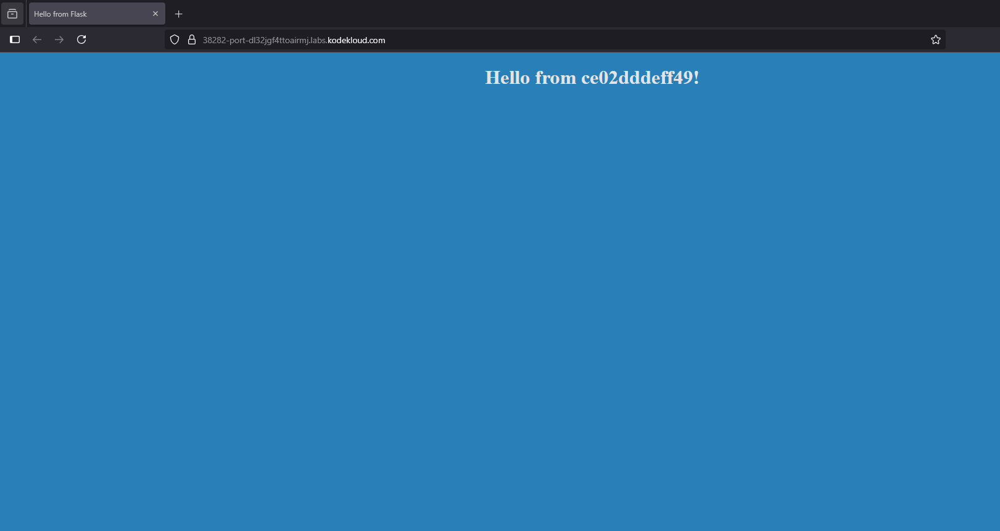

# Docker Environment Variables
Learn how to use environment variables in Docker containers.

0.5H APROX - [LINK](https://studio.kodekloud.com/labs/docker/docker_env_vars)
07/08/2025
## Exercises
### Inspect the environment variables set on the running container and identify the value set to `APP_COLOR` variable.
We see the container running, we execute env and APP_COLOR value is... pink
```bash
~ ➜  docker ps                
CONTAINER ID   IMAGE                     COMMAND           CREATED         STATUS         PORTS      NAMES
ab936672324f   kodekloud/simple-webapp   "python app.py"   2 minutes ago   Up 2 minutes   8080/tcp   kind_benz

~ ➜  docker exec kind_benz env
PATH=/usr/local/bin:/usr/local/sbin:/usr/local/bin:/usr/sbin:/usr/bin:/sbin:/bin
HOSTNAME=ab936672324f
APP_COLOR=pink
LANG=C.UTF-8
GPG_KEY=0D96DF4D4110E5C43FBFB17F2D347EA6AA65421D
PYTHON_VERSION=3.6.6
PYTHON_PIP_VERSION=18.1
HOME=/root
```
In this case -> `pink`

### Run a contained named `blue-app` using image `kodekloud/simple-webapp` and set the environment variable `APP_COLOR` to `blue`. Make the application avaiable on port `38282` on the host. The application listens on port `8080`.

First I tried this, but did not worked:
```bash
~ ➜  docker container run --name blue-app -p 38282:8080 kodekloud/simple-webapp exec "export APP_COLOR=blue"
usage: app.py [-h] [--color COLOR]
app.py: error: unrecognized arguments: exec export APP_COLOR=blue
 This is a sample web application that displays a colored background. 
 A color can be specified in two ways. 

 1. As a command line argument with --color as the argument. Accepts one of red,green,blue,blue2,pink,darkblue 
 2. As an Environment variable APP_COLOR. Accepts one of red,green,blue,blue2,pink,darkblue 
 3. If none of the above then a random color is picked from the above list. 
 Note: Command line argument precedes over environment variable.
```

Later I did this:
```bash
~ ➜  docker container run --name blue-app -p 38282:8080 -e APP_COLOR=blue kodekloud/simple-webapp
 This is a sample web application that displays a colored background. 
 A color can be specified in two ways. 

 1. As a command line argument with --color as the argument. Accepts one of red,green,blue,blue2,pink,darkblue 
 2. As an Environment variable APP_COLOR. Accepts one of red,green,blue,blue2,pink,darkblue 
 3. If none of the above then a random color is picked from the above list. 
 Note: Command line argument precedes over environment variable.


No Command line argument. Color from environment variable =blue
 * Serving Flask app "app" (lazy loading)
 * Environment: production
   WARNING: Do not use the development server in a production environment.
   Use a production WSGI server instead.
 * Debug mode: off
 * Running on http://0.0.0.0:8080/ (Press CTRL+C to quit)
```

**View the application by clicking the link HOST:38282 on the right side of your terminal bar and ensure it has the right colour**



### Deploy a `mysql` database using the `mysql` image and name it `mysql-db`. Set the database password to use `db_pass123`. Lookup the mysql image on Docker Hub and identify the correct environment variable to use for setting the root password.
```bash
~ ➜  docker image ls -a          
REPOSITORY                      TAG       IMAGE ID       CREATED         SIZE
alpine                          latest    91ef0af61f39   11 months ago   7.79MB
nginx                           alpine    c7b4f26a7d93   11 months ago   43.2MB
nginx                           latest    39286ab8a5e1   11 months ago   188MB
postgres                        latest    b781f3a53e61   12 months ago   432MB
ubuntu                          latest    edbfe74c41f8   12 months ago   78MB
redis                           latest    590b81f2fea1   12 months ago   117MB
mysql                           latest    a82a8f162e18   12 months ago   586MB
kodekloud/simple-webapp-mysql   latest    129dd9f67367   6 years ago     96.6MB
kodekloud/simple-webapp         latest    c6e3cd9aae36   6 years ago     84.8MB

~ ➜  docker container run --name mysql-db -e MYSQL_ROOT_PASSWORD=db_pass123 mysql
2025-08-06 22:34:43+00:00 [Note] [Entrypoint]: Entrypoint script for MySQL Server 9.0.1-1.el9 started.
2025-08-06 22:34:44+00:00 [Note] [Entrypoint]: Switching to dedicated user 'mysql'
2025-08-06 22:34:44+00:00 [Note] [Entrypoint]: Entrypoint script for MySQL Server 9.0.1-1.el9 started.
2025-08-06 22:34:45+00:00 [Note] [Entrypoint]: Initializing database files
2025-08-06T22:34:45.410961Z 0 [System] [MY-015017] [Server] MySQL Server Initialization - start.
2025-08-06T22:34:45.421301Z 0 [System] [MY-013169] [Server] /usr/sbin/mysqld (mysqld 9.0.1) initializing of server in progress as process 230
2025-08-06T22:34:45.492182Z 1 [System] [MY-013576] [InnoDB] InnoDB initialization has started.
2025-08-06T22:34:46.002518Z 1 [System] [MY-013577] [InnoDB] InnoDB initialization has ended.
2025-08-06T22:34:50.689647Z 6 [Warning] [MY-010453] [Server] root@localhost is created with an empty password ! Please consider switching off the --initialize-insecure option.
2025-08-06T22:34:53.948031Z 0 [System] [MY-015018] [Server] MySQL Server Initialization - end.
2025-08-06 22:34:53+00:00 [Note] [Entrypoint]: Database files initialized
2025-08-06 22:34:53+00:00 [Note] [Entrypoint]: Starting temporary server
2025-08-06T22:34:54.011695Z 0 [System] [MY-015015] [Server] MySQL Server - start.
2025-08-06T22:34:54.704312Z 0 [System] [MY-010116] [Server] /usr/sbin/mysqld (mysqld 9.0.1) starting as process 281
2025-08-06T22:34:54.721331Z 1 [System] [MY-013576] [InnoDB] InnoDB initialization has started.
2025-08-06T22:34:55.338399Z 1 [System] [MY-013577] [InnoDB] InnoDB initialization has ended.
2025-08-06T22:34:56.063693Z 0 [Warning] [MY-010068] [Server] CA certificate ca.pem is self signed.
2025-08-06T22:34:56.063729Z 0 [System] [MY-013602] [Server] Channel mysql_main configured to support TLS. Encrypted connections are now supported for this channel.
2025-08-06T22:34:56.067309Z 0 [Warning] [MY-011810] [Server] Insecure configuration for --pid-file: Location '/var/run/mysqld' in the path is accessible to all OS users. Consider choosing a different directory.
2025-08-06T22:34:56.111251Z 0 [System] [MY-011323] [Server] X Plugin ready for connections. Socket: /var/run/mysqld/mysqlx.sock
2025-08-06T22:34:56.111454Z 0 [System] [MY-010931] [Server] /usr/sbin/mysqld: ready for connections. Version: '9.0.1'  socket: '/var/run/mysqld/mysqld.sock'  port: 0  MySQL Community Server - GPL.
2025-08-06 22:34:56+00:00 [Note] [Entrypoint]: Temporary server started.
'/var/lib/mysql/mysql.sock' -> '/var/run/mysqld/mysqld.sock'
Warning: Unable to load '/usr/share/zoneinfo/iso3166.tab' as time zone. Skipping it.
Warning: Unable to load '/usr/share/zoneinfo/leap-seconds.list' as time zone. Skipping it.
Warning: Unable to load '/usr/share/zoneinfo/leapseconds' as time zone. Skipping it.
Warning: Unable to load '/usr/share/zoneinfo/tzdata.zi' as time zone. Skipping it.
Warning: Unable to load '/usr/share/zoneinfo/zone.tab' as time zone. Skipping it.
Warning: Unable to load '/usr/share/zoneinfo/zone1970.tab' as time zone. Skipping it.

2025-08-06 22:35:04+00:00 [Note] [Entrypoint]: Stopping temporary server
2025-08-06T22:35:04.189327Z 10 [System] [MY-013172] [Server] Received SHUTDOWN from user root. Shutting down mysqld (Version: 9.0.1).
2025-08-06T22:35:05.244092Z 0 [System] [MY-010910] [Server] /usr/sbin/mysqld: Shutdown complete (mysqld 9.0.1)  MySQL Community Server - GPL.
2025-08-06T22:35:05.244116Z 0 [System] [MY-015016] [Server] MySQL Server - end.
2025-08-06 22:35:06+00:00 [Note] [Entrypoint]: Temporary server stopped

2025-08-06 22:35:06+00:00 [Note] [Entrypoint]: MySQL init process done. Ready for start up.

2025-08-06T22:35:06.211055Z 0 [System] [MY-015015] [Server] MySQL Server - start.
2025-08-06T22:35:06.905145Z 0 [System] [MY-010116] [Server] /usr/sbin/mysqld (mysqld 9.0.1) starting as process 1
2025-08-06T22:35:06.911968Z 1 [System] [MY-013576] [InnoDB] InnoDB initialization has started.
2025-08-06T22:35:07.524170Z 1 [System] [MY-013577] [InnoDB] InnoDB initialization has ended.
2025-08-06T22:35:08.092498Z 0 [Warning] [MY-010068] [Server] CA certificate ca.pem is self signed.
2025-08-06T22:35:08.092545Z 0 [System] [MY-013602] [Server] Channel mysql_main configured to support TLS. Encrypted connections are now supported for this channel.
2025-08-06T22:35:08.096251Z 0 [Warning] [MY-011810] [Server] Insecure configuration for --pid-file: Location '/var/run/mysqld' in the path is accessible to all OS users. Consider choosing a different directory.
2025-08-06T22:35:08.121972Z 0 [System] [MY-011323] [Server] X Plugin ready for connections. Bind-address: '::' port: 33060, socket: /var/run/mysqld/mysqlx.sock
2025-08-06T22:35:08.189413Z 0 [System] [MY-010931] [Server] /usr/sbin/mysqld: ready for connections. Version: '9.0.1'  socket: '/var/run/mysqld/mysqld.sock'  port: 3306  MySQL Community Server - GPL.
```
