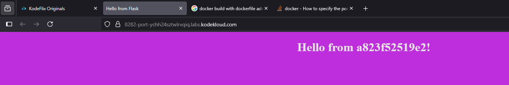

# Docker Images
**Understand Docker images, building custom images, and image management.**

1.25H - [LINK](https://studio.kodekloud.com/labs/docker/docker_images)

## Exercises
### How many `images` are available on this host?
```bash
~ ➜  docker image ls
REPOSITORY                      TAG       IMAGE ID       CREATED         SIZE
alpine                          latest    91ef0af61f39   11 months ago   7.79MB
nginx                           alpine    c7b4f26a7d93   11 months ago   43.2MB
nginx                           latest    39286ab8a5e1   11 months ago   188MB
postgres                        latest    b781f3a53e61   12 months ago   432MB
ubuntu                          latest    edbfe74c41f8   12 months ago   78MB
redis                           latest    590b81f2fea1   12 months ago   117MB
mysql                           latest    a82a8f162e18   12 months ago   586MB
kodekloud/simple-webapp-mysql   latest    129dd9f67367   6 years ago     96.6MB
kodekloud/simple-webapp         latest    c6e3cd9aae36   6 years ago     84.8MB
```

### What is the size of the `ubuntu` image?
```bash
~ ➜  docker image ls | grep ubuntu 
ubuntu                          latest    edbfe74c41f8   12 months ago   78MB
```

### We just pulled a new image. What is the ta on the newly pulled `NGINX` image?
```bash
~ ➜  docker image ls               
REPOSITORY                      TAG           IMAGE ID       CREATED         SIZE
alpine                          latest        91ef0af61f39   11 months ago   7.79MB
nginx                           alpine        c7b4f26a7d93   11 months ago   43.2MB
nginx                           latest        39286ab8a5e1   11 months ago   188MB
postgres                        latest        b781f3a53e61   12 months ago   432MB
ubuntu                          latest        edbfe74c41f8   12 months ago   78MB
redis                           latest        590b81f2fea1   12 months ago   117MB
mysql                           latest        a82a8f162e18   12 months ago   586MB
nginx                           1.14-alpine   8a2fb25a19f5   6 years ago     16MB
kodekloud/simple-webapp-mysql   latest        129dd9f67367   6 years ago     96.6MB
kodekloud/simple-webapp         latest        c6e3cd9aae36   6 years ago     84.8MB
```
In this case, compared with the before one -> `1.14-alpine`

### We just downloaded the code of an application. What is the base image used in the Dockerfile?
**Inspect the Dockerfile in the `webapp-color` directory.**
```bash
~ ➜  ls
webapp-color

~ ➜  ls webapp-color 
Dockerfile        app.py            requirements.txt  templates

~ ➜  cat webapp-color/Dockerfile 
FROM python:3.6

RUN pip install flask

COPY . /opt/

EXPOSE 8080

WORKDIR /opt

ENTRYPOINT ["python", "app.py"]

~ ➜  
```
In this case, the response is -> `python:3.6`

### To what location within the container is the appliaction code copied to dring a Docker buid?
**Inspect the Dockerfile in the `webapp-color` directory.**
In this case, the response is -> `/opt`

### When a cotainer is created using the image built with this Dockerfile , what is the command used to `RUN` the application inside it.
**Inspect the Dockerfile in the `webapp-color` directory.**
```bash
~ ➜  ls             
webapp-color

~ ➜  cat webapp-color/Dockerfile
FROM python:3.6

RUN pip install flask

COPY . /opt/

EXPOSE 8080

WORKDIR /opt

ENTRYPOINT ["python", "app.py"]

~ ➜ 
```
In this case, the response is -> `python app.py` (my first option was the RUN instrcution but idk)

### What `port` is the web application run within the container?
**Inspect the Dockerfile in the `webapp-color` directory.**
In this case, the response is -> `8080`

### Build a docker image using the Dockerfile and name it `webapp-color`. No tag to be specified.
```bash
~/webapp-color via 🐍 ➜  docker build -t webapp-color:latest . 
DEPRECATED: The legacy builder is deprecated and will be removed in a future release.
            BuildKit is currently disabled; enable it by removing the DOCKER_BUILDKIT=0
            environment-variable.

Sending build context to Docker daemon  8.704kB
Step 1/6 : FROM python:3.6
 ---> 54260638d07c
Step 2/6 : RUN pip install flask
 ---> Running in 4f8d57f01bc7
Collecting flask
  Downloading Flask-2.0.3-py3-none-any.whl (95 kB)
Collecting Werkzeug>=2.0
  Downloading Werkzeug-2.0.3-py3-none-any.whl (289 kB)
Collecting click>=7.1.2
  Downloading click-8.0.4-py3-none-any.whl (97 kB)
Collecting Jinja2>=3.0
  Downloading Jinja2-3.0.3-py3-none-any.whl (133 kB)
Collecting itsdangerous>=2.0
  Downloading itsdangerous-2.0.1-py3-none-any.whl (18 kB)
Collecting importlib-metadata
  Downloading importlib_metadata-4.8.3-py3-none-any.whl (17 kB)
Collecting MarkupSafe>=2.0
  Downloading MarkupSafe-2.0.1-cp36-cp36m-manylinux_2_5_x86_64.manylinux1_x86_64.manylinux_2_12_x86_64.manylinux2010_x86_64.whl (30 kB)
Collecting dataclasses
  Downloading dataclasses-0.8-py3-none-any.whl (19 kB)
Collecting zipp>=0.5
  Downloading zipp-3.6.0-py3-none-any.whl (5.3 kB)
Collecting typing-extensions>=3.6.4
  Downloading typing_extensions-4.1.1-py3-none-any.whl (26 kB)
Installing collected packages: zipp, typing-extensions, MarkupSafe, importlib-metadata, dataclasses, Werkzeug, Jinja2, itsdangerous, click, flask
Successfully installed Jinja2-3.0.3 MarkupSafe-2.0.1 Werkzeug-2.0.3 click-8.0.4 dataclasses-0.8 flask-2.0.3 importlib-metadata-4.8.3 itsdangerous-2.0.1 typing-extensions-4.1.1 zipp-3.6.0
WARNING: Running pip as the 'root' user can result in broken permissions and conflicting behaviour with the system package manager. It is recommended to use a virtual environment instead: https://pip.pypa.io/warnings/venv
WARNING: You are using pip version 21.2.4; however, version 21.3.1 is available.
You should consider upgrading via the '/usr/local/bin/python -m pip install --upgrade pip' command.
 ---> Removed intermediate container 4f8d57f01bc7
 ---> 58ef381df722
Step 3/6 : COPY . /opt/
 ---> 045fe3f37707
Step 4/6 : EXPOSE 8080
 ---> Running in a016ffc438c7
 ---> Removed intermediate container a016ffc438c7
 ---> 29f4522a27c2
Step 5/6 : WORKDIR /opt
 ---> Running in 26faafc7912d
 ---> Removed intermediate container 26faafc7912d
 ---> 928bce8f439c
Step 6/6 : ENTRYPOINT ["python", "app.py"]
 ---> Running in de8f9b782c49
 ---> Removed intermediate container de8f9b782c49
 ---> d97eed7e5da4
Successfully built d97eed7e5da4
Successfully tagged webapp-color:latest

~/webapp-color via 🐍 ➜  docker image ls     
REPOSITORY                      TAG           IMAGE ID       CREATED          SIZE
webapp-color                    latest        d97eed7e5da4   30 seconds ago   913MB
alpine                          latest        91ef0af61f39   11 months ago    7.79MB
nginx                           alpine        c7b4f26a7d93   11 months ago    43.2MB
nginx                           latest        39286ab8a5e1   11 months ago    188MB
postgres                        latest        b781f3a53e61   12 months ago    432MB
ubuntu                          latest        edbfe74c41f8   12 months ago    78MB
redis                           latest        590b81f2fea1   12 months ago    117MB
mysql                           latest        a82a8f162e18   12 months ago    586MB
python                          3.6           54260638d07c   3 years ago      902MB
nginx                           1.14-alpine   8a2fb25a19f5   6 years ago      16MB
kodekloud/simple-webapp-mysql   latest        129dd9f67367   6 years ago      96.6MB
kodekloud/simple-webapp         latest        c6e3cd9aae36   6 years ago      84.8MB
```

### Run an instance of the image `webapp-color` and publish port `8080` on the container to `8282` on the host.
```bash
~/webapp-color via 🐍 ➜  docker image ls                     
REPOSITORY                      TAG           IMAGE ID       CREATED         SIZE
webapp-color                    latest        d97eed7e5da4   4 minutes ago   913MB
alpine                          latest        91ef0af61f39   11 months ago   7.79MB
nginx                           alpine        c7b4f26a7d93   11 months ago   43.2MB
nginx                           latest        39286ab8a5e1   11 months ago   188MB
postgres                        latest        b781f3a53e61   12 months ago   432MB
ubuntu                          latest        edbfe74c41f8   12 months ago   78MB
redis                           latest        590b81f2fea1   12 months ago   117MB
mysql                           latest        a82a8f162e18   12 months ago   586MB
python                          3.6           54260638d07c   3 years ago     902MB
nginx                           1.14-alpine   8a2fb25a19f5   6 years ago     16MB
kodekloud/simple-webapp-mysql   latest        129dd9f67367   6 years ago     96.6MB
kodekloud/simple-webapp         latest        c6e3cd9aae36   6 years ago     84.8MB

~/webapp-color via 🐍 ➜  docker run -p 8282:8080 webapp-color
 This is a sample web application that displays a colored background. 
 A color can be specified in two ways. 

 1. As a command line argument with --color as the argument. Accepts one of red,green,blue,blue2,pink,darkblue 
 2. As an Environment variable APP_COLOR. Accepts one of red,green,blue,blue2,pink,darkblue 
 3. If none of the above then a random color is picked from the above list. 
 Note: Command line argument precedes over environment variable.


No command line argument or environment variable. Picking a Random Color =pink
 * Serving Flask app 'app' (lazy loading)
 * Environment: production
   WARNING: This is a development server. Do not use it in a production deployment.
   Use a production WSGI server instead.
 * Debug mode: off
 * Running on all addresses.
   WARNING: This is a development server. Do not use it in a production deployment.
 * Running on http://172.12.0.2:8080/ (Press CTRL+C to quit)
```
**Access the application by clicking on the tab named `HOST:8282` above your terminal.
After you are done, you may stop the running container by hitting `CTRL + C` if you wish to**



### What is the base Operating System used by the `python:3.6` image?
**If required, run an instance of the image to figure it out.**
```bash
~/webapp-color via 🐍 ✖ docker run -it --entrypoint /bin/bash webapp-color
root@1a5c737e633b:/opt# cat /etc/
Display all 102 possibilities? (y or n)
root@1a5c737e633b:/opt# cat /etc/*release&
[1] 61
root@1a5c737e633b:/opt# PRETTY_NAME="Debian GNU/Linux 11 (bullseye)"
NAME="Debian GNU/Linux"
VERSION_ID="11"
VERSION="11 (bullseye)"
VERSION_CODENAME=bullseye
ID=debian
HOME_URL="https://www.debian.org/"
SUPPORT_URL="https://www.debian.org/support"
BUG_REPORT_URL="https://bugs.debian.org/"
^C
[1]+  Done                    cat /etc/*release
root@1a5c737e633b:/opt# 
exit

~/webapp-color via 🐍 ✖ 
```
In this case -> `debian`

### What is the approximate size of the `webapp-color` image?
```bash

~/webapp-color via 🐍 ➜  docker image ls -a | grep webapp
webapp-color                    latest        d97eed7e5da4   20 minutes ago   913MB
kodekloud/simple-webapp-mysql   latest        129dd9f67367   6 years ago      96.6MB
kodekloud/simple-webapp         latest        c6e3cd9aae36   6 years ago      84.8MB

~/webapp-color via 🐍 ➜  
```
In this case -> `920MB`

**That's really BIG for a Docker Image. Docker images are supposed to be small and liht weight.
Let s try to trim it down.**

### Build a new smaller docker image by modifying the same Dockerfile and name it `webapp-color` and tag it `lite`.
**Hint: Find a smaller base image for `python:3.6`. Make sure the final image is less than `150MB`.
```bash
~/webapp-color via 🐍 ➜  ls
Dockerfile        app.py            requirements.txt  templates

~/webapp-color via 🐍 ➜  cat Dockerfile     
FROM python:3.6

RUN pip install flask

COPY . /opt/

EXPOSE 8080

WORKDIR /opt

ENTRYPOINT ["python", "app.py"]

~/webapp-color via 🐍 ➜  vim Dockerfile 

~/webapp-color via 🐍 ➜  cat Dockerfile 
FROM python:3.6.13-slim-stretch

RUN pip install flask

COPY . /opt/

EXPOSE 8080

WORKDIR /opt

ENTRYPOINT ["python", "app.py"]

~/webapp-color via 🐍 ➜  docker build -t webapp-color:lite .             
DEPRECATED: The legacy builder is deprecated and will be removed in a future release.
            BuildKit is currently disabled; enable it by removing the DOCKER_BUILDKIT=0
            environment-variable.

Sending build context to Docker daemon  8.704kB
Step 1/6 : FROM python:3.6.13-slim-stretch
3.6.13-slim-stretch: Pulling from library/python
aed007321795: Pull complete 
8f16ed85ea43: Pull complete 
d82411a11414: Pull complete 
95052f8fe920: Pull complete 
c492ae7dabf8: Pull complete 
Digest: sha256:06596a93e12c05ea61c816bf5cce8221c441346f9273ec08a3ef5de50aa75c4a
Status: Downloaded newer image for python:3.6.13-slim-stretch
 ---> 586db3982391
Step 2/6 : RUN pip install flask
 ---> Running in d57f2d917915
Collecting flask
  Downloading Flask-2.0.3-py3-none-any.whl (95 kB)
Collecting click>=7.1.2
  Downloading click-8.0.4-py3-none-any.whl (97 kB)
Collecting Werkzeug>=2.0
  Downloading Werkzeug-2.0.3-py3-none-any.whl (289 kB)
Collecting itsdangerous>=2.0
  Downloading itsdangerous-2.0.1-py3-none-any.whl (18 kB)
Collecting Jinja2>=3.0
  Downloading Jinja2-3.0.3-py3-none-any.whl (133 kB)
Collecting importlib-metadata
  Downloading importlib_metadata-4.8.3-py3-none-any.whl (17 kB)
Collecting MarkupSafe>=2.0
  Downloading MarkupSafe-2.0.1-cp36-cp36m-manylinux_2_5_x86_64.manylinux1_x86_64.manylinux_2_12_x86_64.manylinux2010_x86_64.whl (30 kB)
Collecting dataclasses
  Downloading dataclasses-0.8-py3-none-any.whl (19 kB)
Collecting typing-extensions>=3.6.4
  Downloading typing_extensions-4.1.1-py3-none-any.whl (26 kB)
Collecting zipp>=0.5
  Downloading zipp-3.6.0-py3-none-any.whl (5.3 kB)
Installing collected packages: zipp, typing-extensions, MarkupSafe, importlib-metadata, dataclasses, Werkzeug, Jinja2, itsdangerous, click, flask
Successfully installed Jinja2-3.0.3 MarkupSafe-2.0.1 Werkzeug-2.0.3 click-8.0.4 dataclasses-0.8 flask-2.0.3 importlib-metadata-4.8.3 itsdangerous-2.0.1 typing-extensions-4.1.1 zipp-3.6.0
WARNING: Running pip as the 'root' user can result in broken permissions and conflicting behaviour with the system package manager. It is recommended to use a virtual environment instead: https://pip.pypa.io/warnings/venv
WARNING: You are using pip version 21.1.3; however, version 21.3.1 is available.
You should consider upgrading via the '/usr/local/bin/python -m pip install --upgrade pip' command.
 ---> Removed intermediate container d57f2d917915
 ---> 74d69c354f8c
Step 3/6 : COPY . /opt/
 ---> cf931b962b86
Step 4/6 : EXPOSE 8080
 ---> Running in 111f58807c17
 ---> Removed intermediate container 111f58807c17
 ---> ccb1abf3df9b
Step 5/6 : WORKDIR /opt
 ---> Running in 00a3a89ea368
 ---> Removed intermediate container 00a3a89ea368
 ---> c35571182026
Step 6/6 : ENTRYPOINT ["python", "app.py"]
 ---> Running in 467f67f5b160
 ---> Removed intermediate container 467f67f5b160
 ---> 25113f99428f
Successfully built 25113f99428f
Successfully tagged webapp-color:lite

~/webapp-color via 🐍 ➜  
```
I found this one in google so --> https://hub.docker.com/layers/library/python/3.6.13-slim-stretch/images/sha256-6e1ca7928286802e265855ce7dcc245a1e51f1dde39fa0cfa8d659c003b4985a
```bash
~/webapp-color via 🐍 ➜  docker image ls | grep lite        
webapp-color                    lite                  012917e08814   2 minutes ago   108MB

~/webapp-color via 🐍 ➜  
```

## Run an instance of the new image `webapp-color:lite` and publish port `8080` on the container to `8383` on the host.
```bash
~/webapp-color via 🐍 ➜  docker run -p 8383:8080 webapp-color:lite  
 This is a sample web application that displays a colored background. 
 A color can be specified in two ways. 

 1. As a command line argument with --color as the argument. Accepts one of red,green,blue,blue2,pink,darkblue 
 2. As an Environment variable APP_COLOR. Accepts one of red,green,blue,blue2,pink,darkblue 
 3. If none of the above then a random color is picked from the above list. 
 Note: Command line argument precedes over environment variable.


No command line argument or environment variable. Picking a Random Color =red
 * Serving Flask app 'app' (lazy loading)
 * Environment: production
   WARNING: This is a development server. Do not use it in a production deployment.
   Use a production WSGI server instead.
 * Debug mode: off
 * Running on all addresses.g
   WARNING: This is a development server. Do not use it in a production deployment.
 * Running on http://172.12.0.2:8080/ (Press CTRL+C to quit)

```

