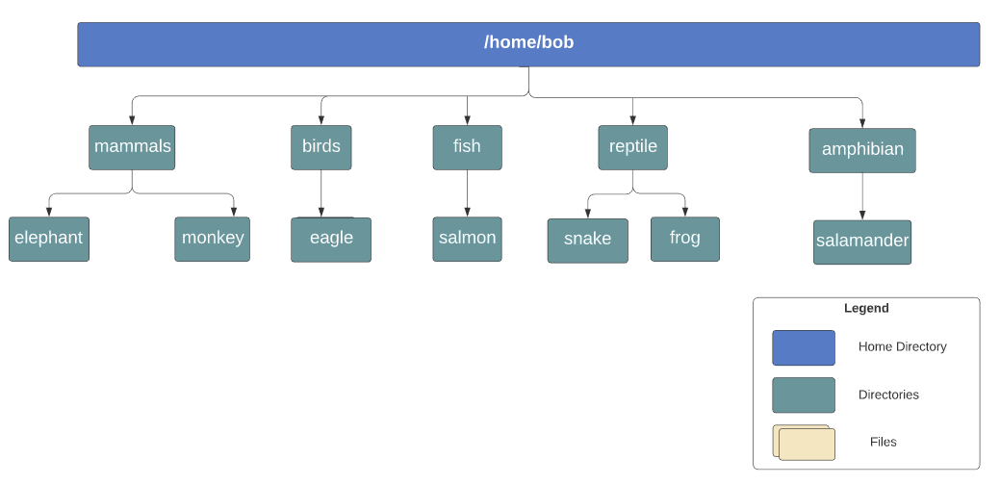
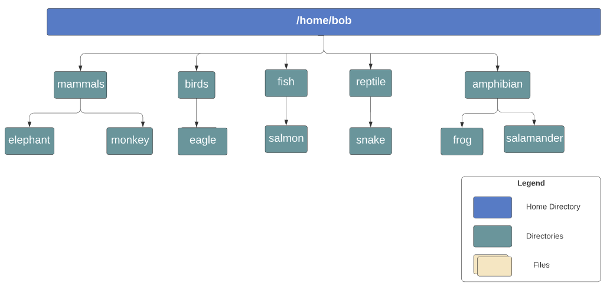
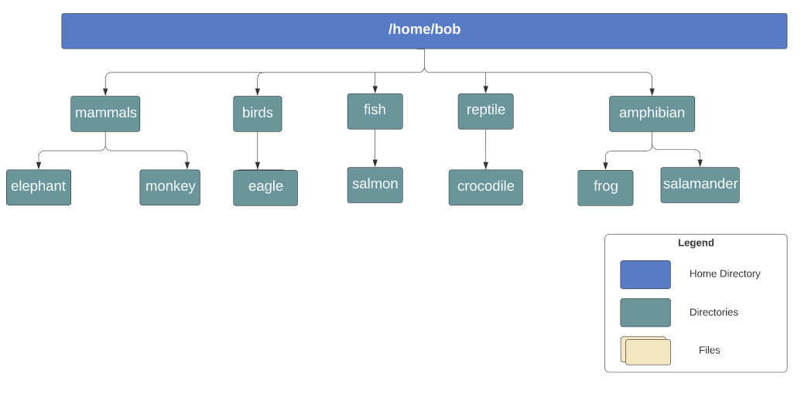
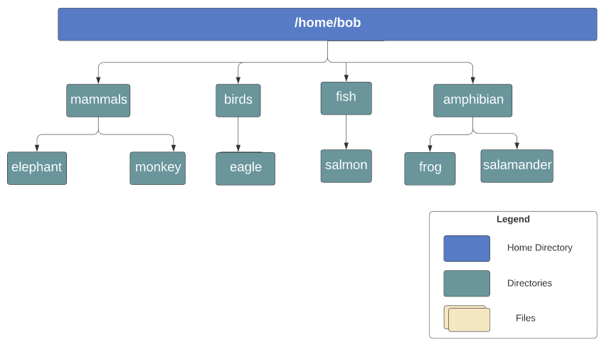

# Linux Basic Commands 1
**Master the essential Linux Commands for navigation and file management**
20minutes aprox - [LINk](https://studio.kodekloud.com/labs/linux/linux-commands-1) - 07/08/2025

## Exercise
### What is the home directory for the user called `bob`?
```bash
ls /home
```
`/home/bob`

### Which of the following commands will show you your home directory?
**If ensure, try out the commands in the terminal and find the answer!**
```bash
echo $HOME
```

### In the command `echo Welcome`, what does the word `Welcome` represent with respect to the command
Argument.

### What type of command is `git`?
file

### Now, lets create some directories! Refer to the below diagram and create the directory called `birds`.
**The home directory `/home/bob` already exists.**



```bash
bob@caleston-lp10:~$ pwd
/home/bob
bob@caleston-lp10:~$ ls
caleston-code.tar.gz  media
bob@caleston-lp10:~$ mkdir mammals
bob@caleston-lp10:~$ mkdir mammals/elephant mammals/monkey 
bob@caleston-lp10:~$ mkdir -p birds/eagle
bob@caleston-lp10:~$ ls
birds  caleston-code.tar.gz  mammals  media
bob@caleston-lp10:~$ ls birds/eagle/
bob@caleston-lp10:~$ mkdir -p fish/salmon
bob@caleston-lp10:~$ mkdir -p reptile/snake
bob@caleston-lp10:~$ mkdir -p reptile/frog 
bob@caleston-lp10:~$ mkdir -p amphibian/salamander
bob@caleston-lp10:~$ ls
amphibian  birds  caleston-code.tar.gz  fish  mammals  media  reptile
bob@caleston-lp10:~$ ls */*
amphibian/salamander:

birds/eagle:

fish/salmon:

mammals/elephant:

mammals/monkey:

media/images:
AI.jpeg          Callus.jpeg          ITSol.jpeg          bob.jpeg          bob_mrVjbWI.jpeg   cloud_khN0g6f.jpg
AI_1eAcYgD.jpeg  Callus_23mwDJ4.jpeg  ITSol_1hfBNTJ.jpeg  bob_3jqSGqs.jpeg  cloud.jpg          dave.jpeg
Andrew.jpeg      DC.jpg               ITSol_QM6FyZg.jpeg  bob_MhWabbx.jpeg  cloud_EupHr5p.jpg

reptile/frog:

reptile/snake:
bob@caleston-lp10:~$ 
```

### Next, create the directories `/home/bob/fish/salmon`
**Use the -p option to create both directories in one go**
(I did this before the explication...)
```bash
bob@caleston-lp10:~$ mkdir -p fish/salmon/
bob@caleston-lp10:~$ ls
amphibian  birds  caleston-code.tar.gz  fish  mammals  media  reptile
bob@caleston-lp10:~$ 
```
### Now, create all the remaining directories as per the diagram below.
I did nothing here... (is the same pic as before)...
### Moving along. Lets now move the directory called `frog` from `reptile` to the directory `amphibian`.

```bash
bob@caleston-lp10:~$ find . -iname "frog"
./reptile/frog
bob@caleston-lp10:~$ mv reptile/frog/ amphibian/frog
bob@caleston-lp10:~$ find . -iname "frog"
./amphibian/frog
bob@caleston-lp10:~$ 
```
### Next, rename the directory `snake` to `crocodile`

```bash
bob@caleston-lp10:~$ find . -iname "snake"
./reptile/snake
bob@caleston-lp10:~$ mv reptile/snake/ reptile/crocodile
bob@caleston-lp10:~$ find . -iname "snake"
bob@caleston-lp10:~$ find . -iname "crocodile"
./reptile/crocodile
bob@caleston-lp10:~$ 
```
### Finally, delete the directory called `reptile` along with its contents

```bash
bob@caleston-lp10:~$ ls
amphibian  birds  caleston-code.tar.gz  fish  mammals  media  reptile
bob@caleston-lp10:~$ rm -rf reptile/
bob@caleston-lp10:~$ ls
amphibian  birds  caleston-code.tar.gz  fish  mammals  media
bob@caleston-lp10:~$ 
```

